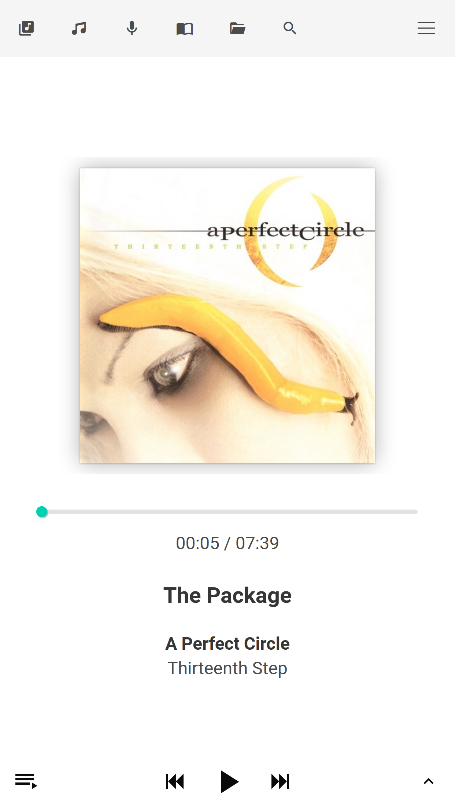
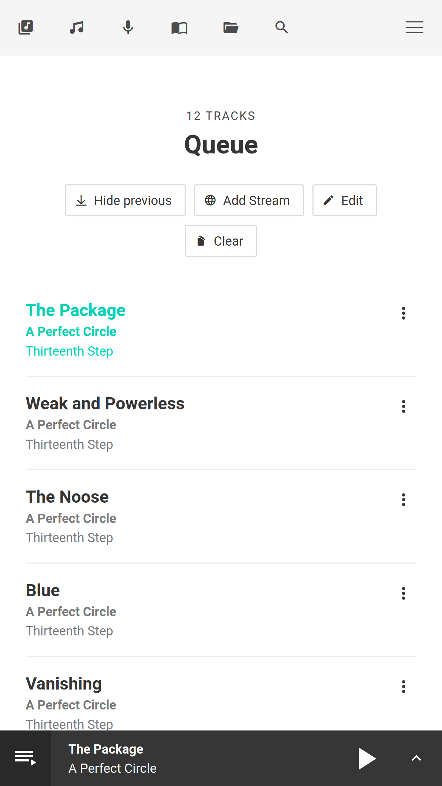
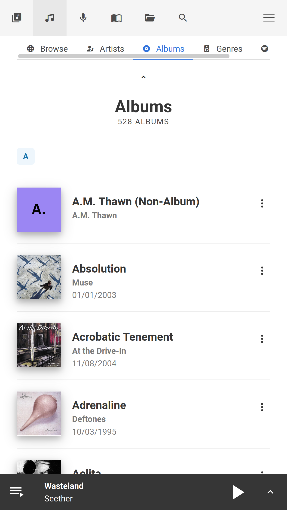

# Web Interface

The web interface is a mobile-friendly music player and browser for OwnTone.

You can reach it at [http://owntone.local:3689](http://owntone.local:3689)
or depending on the OwnTone installation at `http://<server-address>:<port>`.

This interface becomes useful when you need to control playback, trigger
manual library rescans, pair with remotes, select speakers, grant access to
Spotify, and for many other operations.

## Screenshots

Below you have a selection of screenshots that shows different part of the
interface.

{: class="zoom" }
{: class="zoom" }
{: class="zoom" }
{: class="zoom" }
{: class="zoom" }
{: class="zoom" }
{: class="zoom" }
{: class="zoom" }
{: class="zoom" }
{: class="zoom" }
{: class="zoom" }
{: class="zoom" }
{: class="zoom" }
{: class="zoom" }
{: class="zoom" }
{: class="zoom" }
{: class="zoom" }

## Usage

The web interface is usually reachable at [http://owntone.local:3689](http://owntone.local:3689).
But depending on the setup of OwnTone you might need to adjust the server name
and port of the server accordingly `http://<server-name>:<port>`.

## Building and Serving

The web interface is built with [Vite](https://vitejs.dev/) and [Bulma](http://bulma.io).

Its source code is located in the `web-src` folder and therefore all `npm`
commands must be run under this folder.

To switch to this folder, run the command hereafter.

```shell
cd web-src
```

### Dependencies Installation

First of all, the dependencies to libraries must be installed with the command
below.

```shell
npm install
```

Once the libraries installed, you can either [build](#source-code-building),
[format](#source-code-formatting), and [lint](#source-code-linting) the source
code, or [serve](#serving) the web interface locally.

### Source Code Building

The following command builds the web interface for production with minification
and stores it under the folder `../htdocs`.

```shell
npm run build
```

### Source Code Formatting

The source code follows certain formatting conventions for maintainability and
readability. To ensure that the source code follows these conventions,
[Prettier](https://prettier.io/) is used.

The command below applies formatting conventions to the source code based on a
preset configuration. Note that a additional configuration is made in the file
`.prettierrc.json`.

```shell
npm run format
```

### Source Code Linting

In order to flag programming errors, bugs, stylistic errors and suspicious
constructs in the source code, [ESLint](https://eslint.org) is used.

Note that ESLint has been configured following this [guide](https://vueschool.io/articles/vuejs-tutorials/eslint-and-prettier-with-vite-and-vue-js-3/).

The following command lints the source code and fixes all automatically fixable
errors.

```shell
npm run lint
```

### Serving

In order to serve locally the web interface, the following command can be run.

```shell
npm run serve
```

After running `npm run serve` the web interface is reachable at [localhost:3000](http://localhost:3000).

By default the above command expects the OwnTone server to be running at
[localhost:3689](http://localhost:3689) and proxies API calls to this location.

If the server is running at a different location you have to set the
environment variable `VITE_OWNTONE_URL`, like in the example below.

```shell
export VITE_OWNTONE_URL=http://owntone.local:3689
npm run serve
```
